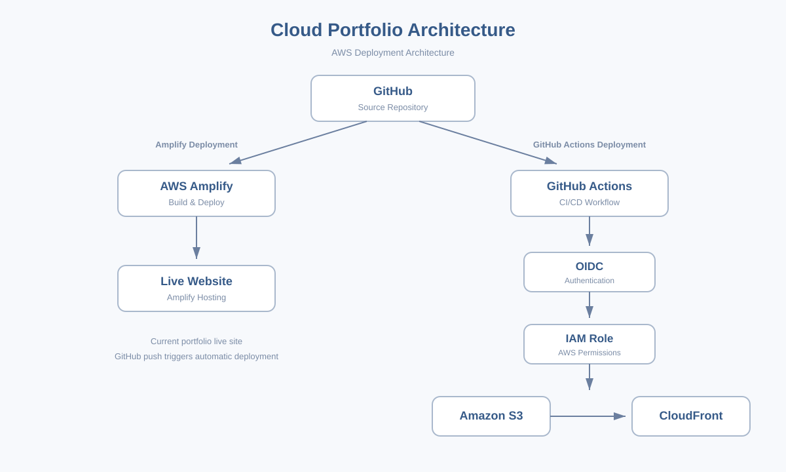

# Cloud Portfolio

AWS Amplify를 활용해 배포한 개인 Cloud & Web Developer 포트폴리오입니다.

## 프로젝트 소개

HTML, CSS, JavaScript로 제작한 반응형 포트폴리오 웹사이트입니다.

GitHub와 AWS Amplify를 연결해 코드 변경 시 자동으로 배포되는 CI/CD 환경을 구성했습니다.

## Tech Stack

- AWS
- AWS Amplify
- Amazon S3
- CloudFront
- IAM
- OIDC
- GitHub Actions
- HTML5
- CSS3
- JavaScript
- Git
- GitHub
- Responsive Web Design

## 주요 기능

- Desktop, Tablet, Mobile 반응형 디자인
- Cloud / Landing 프로젝트 필터링
- 스크롤 애니메이션
- GitHub 및 Live Site 연결
- AWS Amplify 자동 배포
- 프로젝트별 기술 스택 정리

## 배포 구조

이 프로젝트는 두 가지 AWS 배포 방식을 구성했습니다.

### 1. AWS Amplify 배포

현재 포트폴리오 Live Site는 GitHub와 AWS Amplify를 연결해 자동 배포됩니다.

```text
Local Development
        ↓
      GitHub
        ↓
   AWS Amplify
        ↓
   Build & Deploy
        ↓
    Live Website
```

`main` 브랜치에 코드가 Push되면 AWS Amplify가 변경 사항을 감지하고 자동으로 새로운 버전을 배포합니다.

### 2. GitHub Actions 기반 AWS 배포

GitHub Actions를 이용한 별도의 AWS 배포 파이프라인도 구성했습니다.

```text
Local Development
        ↓
      GitHub
        ↓
  GitHub Actions
        ↓
       OIDC
        ↓
    IAM Role
        ↓
       S3
        ↓
   CloudFront
```

GitHub Actions가 실행되면 OIDC를 통해 AWS IAM Role을 사용하여 안전하게 AWS에 인증합니다.

이후 웹사이트 파일을 S3에 배포하고 CloudFront 캐시를 갱신합니다.

### CI/CD

두 배포 방식 모두 코드 변경 후 배포 과정을 자동화하는 CI/CD 구조를 사용합니다.

- AWS Amplify: GitHub와 연결된 자동 Build & Deploy
- GitHub Actions: Workflow를 이용한 S3 / CloudFront 자동 배포
- OIDC: GitHub Actions와 AWS 사이의 안전한 인증

## Architecture Diagram



## Projects

### Cloud Portfolio

AWS Amplify 자동 배포와 GitHub Actions 기반 AWS 배포 파이프라인을 구성한 개인 포트폴리오 프로젝트입니다.

### Landing Pages

카페, 뷰티, 피트니스 등 다양한 브랜드 콘셉트의 반응형 랜딩페이지를 제작했습니다.

## 향후 개선

- Custom Domain 연결
- Multi-environment Architecture 확장
- 추가 Cloud Project 구축
- 보안 구성 강화

## Author

**Arang**  
Cloud & Web Developer

GitHub: https://github.com/Arang-K